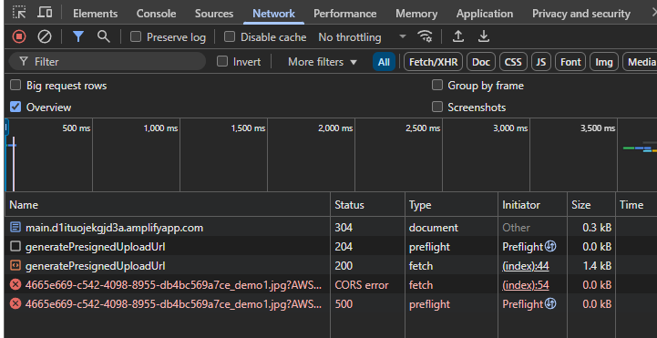

# KIV for now
## Issue with CORS when upload image to s3

🧪 Phase 1: Problem Definition & Architecture
Goal: Recommend 3 skincare products based on user selfie + survey.

Input:

📸 A selfie (face with acne, oily/dry indicators)

📝 Survey: skin type, skin concerns (acne, dryness, pigmentation), budget

Output:

🎯 3 recommended products (from your curated list)

🏗️ Architecture (Simplified E2E Flow)
rust
Copy
Edit
[User Uploads Data]
     |
     +--> [S3] <-- stores image + survey
     |
     +--> [Lambda] --> trigger inference logic
             |
     +--> [SageMaker endpoint]
             |
     +--> [Recommendation logic]
             |
     +--> [Frontend: shows top 3 products]
Optional: Use SageMaker Feature Store to store survey answers for future analysis.

⚙️ Phase 2: Tools & AWS Services
Function	AWS Service
Image Classification Model	SageMaker JumpStart (e.g. ResNet)
Store Image + Survey	Amazon S3
Trigger Inference	Lambda
Store user answers	SageMaker Feature Store
Deploy Static Frontend	S3 + CloudFront
Orchestration / Auth (optional)	API Gateway + Cognito

🛠️ Phase 3: MVP Plan
1. Prepare Your Dataset (for training or testing)
Find a public acne image dataset (e.g., Acne04 Dataset)

Label them (e.g. mild, moderate, severe, clear)

OR use JumpStart pre-trained classification model and skip training for now.

2. Build Survey Form (Static Site on S3)
Fields:

Skin type: [Dry, Oily, Combo, Sensitive]

Skin concerns: [Acne, Redness, Pigmentation, Dryness]

Budget: [<RM50, RM50–RM150, >RM150]

Uploads selfie + JSON-formatted survey to S3

3. Deploy Image Classifier via SageMaker
Option A: Use JumpStart model (e.g. ResNet, MobileNet)

Option B: Fine-tune a smaller model using your dataset (if needed later)

Deploy as real-time endpoint

4. Inference Lambda
Triggered when new selfie + survey uploaded

Calls image classifier endpoint

Reads survey answers

Uses simple rules to select 3 products

python
Copy
Edit
if severity == "moderate" and skin_type == "oily":
    return ["COSRX BHA", "CeraVe Foaming", "La Roche Effaclar"]
5. Frontend to Display Recommendation
Shows product name, image, link to Shopee/Lazada

Use Bootstrap or TailwindCSS for clean UI

🌱 Bonus (Later Phases)
Add Bedrock Claude for product explanation: “Why we recommend this for your skin”

Store survey results to Feature Store for training future ML models

Schedule monthly training with SageMaker Pipelines

Create user login with Cognito

💼 What This Shows in Your Portfolio
✅ Image + text input processing
✅ Integration of S3, Lambda, SageMaker, Feature Store
✅ Frontend skills
✅ Real-world ML use case (commerce + beauty)
✅ Ability to architect full ML pipelines

------

ML portion

Game plan (MVP first, then level up)
MVP (fast & useful):

Detect a few visual signals from the selfie: acne, redness, hyperpigmentation, pores (scores: 0–3).

Combine with a short 2–5 question survey (skin type, sensitivity, goals).

Map to recommendations via a simple rules engine (DynamoDB table) and return a tidy JSON you can show on the site.

Why this first: a single photo can’t reliably infer everything (hydration/sensitivity often need history or questionnaire). This hybrid gets you good suggestions right away and is easy to improve later.

High-level architecture
Upload (you already have)
→ S3 event on uploaded/
→ Lambda: dispatch to SageMaker Async Inference (input S3 URI, output to analysis/)
→ S3 event on analysis/
→ Lambda: postprocess (merge with survey features; lookup rules; optionally prompt an LLM for a human-friendly explanation)
→ Store final recommendation JSON in DynamoDB + recommendations/ S3
→ Frontend polls GET /result?key=<object_key> until ready and renders.

(Async Inference is perfect here: you don’t block the browser and you only pay when used.)

Step-by-step build
0) Names (edit if you like)
Bucket: afiqkurshid-skincare-machinelearning

Upload prefix: uploaded/

Analysis prefix (outputs from model): analysis/

Recs prefix (final, user-facing): recommendations/

Async endpoint name: skin-analyzer-endpoint

DynamoDB tables:

skincare_jobs (PK: object_key, attrs: status, analysis_uri, rec_uri, timestamps)

skincare_rules (PK: rule_id) – simple rows that map scores+answers → product lists

(Optional) skincare_survey (PK: object_key) or use Feature Store later

1) Create the DynamoDB job table
bash
Copy
Edit
aws dynamodb create-table \
  --table-name skincare_jobs \
  --attribute-definitions AttributeName=object_key,AttributeType=S \
  --key-schema AttributeName=object_key,KeyType=HASH \
  --billing-mode PAY_PER_REQUEST \
  --region ap-southeast-1
(You can add GSI later if you want to query by date/user.)

2) Train or pick a model (3 options)
Option A — Quickest: start with a placeholder model
Until you train, you can stand up a dummy container that returns fixed scores (to wire the system). I can give you a minimal handler if you want to simulate results today.

Option B — Built-in Image Classification (no custom Docker)
Use SageMaker’s built-in Image Classification (ResNet). You’ll need a small labeled set:

Labels: acne_{none,mild,moderate,severe}, redness_{low,med,high}, pigmentation_{low,med,high}, pores_{low,med,high}

Organize S3 like: s3://.../train/<label>/img.jpg, s3://.../val/<label>/img.jpg

Train with the SageMaker SDK (Notebook/Studio). Later, deploy to an Async endpoint (serverless or instance-backed).

Option C — Custom PyTorch/TensorFlow (JumpStart or your own weights)
Fine-tune EfficientNet/ConvNeXt on your dataset. Deploy as a Model with a simple inference.py handler that reads an S3 image and returns scores.

My recommendation: Option B to start. It’s quickest to get real outputs without managing Docker.

3) Create an Async Inference endpoint
Once you have a model artifact or a built-in model image URI, create:

a Model

an EndpointConfig (async settings)

an Endpoint (e.g., skin-analyzer-endpoint)

If using the SDK, it’s a few lines with AsyncInferenceConfig (input: S3; output: s3://…/analysis/). If you want, I’ll write that SDK snippet next once you confirm Option B or C.

4) Lambda: on-upload-dispatch (S3 → Async invoke)
Trigger: S3 ObjectCreated:* on prefix uploaded/.

What it does:

Writes a “job started” row to skincare_jobs

Calls SageMaker Runtime invoke_endpoint_async with:

InputLocation: the just-uploaded S3 object

RequestedOutputLocation: s3://.../analysis/ (or rely on endpoint config)

Returns 202.

Policy (add to role):

s3:GetObject on uploaded/*

s3:PutObject on analysis/*

sagemaker:InvokeEndpointAsync on your endpoint

dynamodb:PutItem/UpdateItem on skincare_jobs

Code (Python 3.12) — on_upload_dispatch.py:

python
Copy
Edit
import os, json, time
import boto3

SM_ENDPOINT = os.environ['SM_ENDPOINT']  # skin-analyzer-endpoint
OUTPUT_PREFIX = os.environ.get('OUTPUT_PREFIX', 'analysis/')
BUCKET = os.environ['BUCKET']
TABLE = os.environ['JOB_TABLE']

smr = boto3.client('sagemaker-runtime')
dyna = boto3.client('dynamodb')

def handler(event, context):
    # S3 event → one or more records
    for rec in event.get('Records', []):
        b = rec['s3']['bucket']['name']
        k = rec['s3']['object']['key']
        if not k.startswith('uploaded/'):  # guardrail
            continue

        object_key = k
        input_s3 = f"s3://{b}/{k}"
        output_s3 = f"s3://{BUCKET}/{OUTPUT_PREFIX}"

        # upsert job row
        dyna.put_item(
            TableName=TABLE,
            Item={
                'object_key': {'S': object_key},
                'status':     {'S': 'QUEUED'},
                'created_at': {'N': str(int(time.time()))}
            }
        )

        # async inference
        smr.invoke_endpoint_async(
            EndpointName=SM_ENDPOINT,
            InputLocation=input_s3,
            ContentType='application/x-image',
            Accept='application/json',
            InferenceId=object_key.replace('/', '_'),  # ties outputs to object
            OutputLocation=output_s3
        )

    return {'statusCode': 200}
Environment:

SM_ENDPOINT=skin-analyzer-endpoint

BUCKET=afiqkurshid-skincare-machinelearning

JOB_TABLE=skincare_jobs

OUTPUT_PREFIX=analysis/

Wire this Lambda to your bucket event (prefix uploaded/).

5) Lambda: on-analysis-complete (S3 analysis/ → make recs)
Trigger: S3 ObjectCreated:* on prefix analysis/.

What it does:

Reads the model’s JSON (e.g., {"acne":2,"redness":1,"pigmentation":1,"pores":2})

Optionally fetches survey answers for the same object_key

Applies rules (or calls an LLM to generate friendly text)

Saves final recommendation JSON to recommendations/…json

Updates DynamoDB job row with status=READY and rec_uri

Policy:

s3:GetObject on analysis/*

s3:PutObject on recommendations/*

dynamodb:UpdateItem on skincare_jobs

(Optional) dynamodb:GetItem on skincare_survey

Code (Python 3.12) — on_analysis_complete.py:

python
Copy
Edit
import os, json, time, urllib.parse
import boto3

BUCKET     = os.environ['BUCKET']
TABLE      = os.environ['JOB_TABLE']
RECS_PREFIX= os.environ.get('RECS_PREFIX', 'recommendations/')

s3   = boto3.client('s3')
dyna = boto3.client('dynamodb')

def handler(event, context):
    for rec in event.get('Records', []):
        b = rec['s3']['bucket']['name']
        k = urllib.parse.unquote(rec['s3']['object']['key'])

        if not k.startswith('analysis/'):
            continue

        # Derive original uploaded key from filename or embed it in InferenceId
        # Here we assume the model wrote a JSON next to input with same basename.
        obj = s3.get_object(Bucket=b, Key=k)
        analysis = json.loads(obj['Body'].read().decode('utf-8'))

        # Example analysis schema (tweak to your model):
        # analysis = {"acne":2,"redness":1,"pigmentation":1,"pores":2,"object_key":"uploaded/2025/08/13/...jpg"}
        object_key = analysis.get('object_key') or infer_object_key_from(k)

        # Simple rules engine (replace with DynamoDB-driven rules)
        rec = make_recommendations(analysis)

        # Save recommendation JSON
        rec_key = f"{RECS_PREFIX}{object_key.replace('uploaded/','').replace('/','_')}.json"
        s3.put_object(
            Bucket=BUCKET,
            Key=rec_key,
            Body=json.dumps({
                "object_key": object_key,
                "analysis": analysis,
                "recommendations": rec,
                "generated_at": int(time.time())
            }, ensure_ascii=False).encode('utf-8'),
            ContentType='application/json'
        )

        # Update job row
        dyna.update_item(
            TableName=TABLE,
            Key={'object_key': {'S': object_key}},
            UpdateExpression="SET #s = :ready, rec_uri = :r, updated_at = :t",
            ExpressionAttributeNames={'#s': 'status'},
            ExpressionAttributeValues={
                ':ready': {'S':'READY'},
                ':r': {'S': f"s3://{BUCKET}/{rec_key}"},
                ':t': {'N': str(int(time.time()))}
            }
        )

    return {'statusCode': 200}

def infer_object_key_from(analysis_key: str) -> str:
    # TODO: tie back to original; e.g., parse InferenceId or have the model echo the input key
    # For now, raise:
    raise RuntimeError("object_key not found in analysis; ensure model writes it or encode in InferenceId")

def make_recommendations(analysis: dict) -> dict:
    acne = analysis.get('acne', 0)
    redness = analysis.get('redness', 0)
    pigment = analysis.get('pigmentation', 0)
    pores = analysis.get('pores', 0)

    recs = []
    # very simple starter rules; replace with DynamoDB driven rules
    if acne >= 2:
        recs += [
          {"step":"Cleanser","product":"Gentle gel cleanser, salicylic 0.5–2%","usage":"AM/PM"},
          {"step":"Treatment","product":"Benzoyl peroxide 2.5% (spot)","usage":"PM"},
          {"step":"Moisturizer","product":"Non-comedogenic, lightweight","usage":"AM/PM"}
        ]
    if redness >= 2:
        recs += [
          {"step":"Serum","product":"Niacinamide 5%","usage":"AM/PM"},
          {"step":"Sunscreen","product":"Broad spectrum SPF50+","usage":"AM"}
        ]
    if pigment >= 2:
        recs += [
          {"step":"Treatment","product":"Azelaic acid 10% or arbutin","usage":"PM"},
          {"step":"Sunscreen","product":"SPF50+ strict daily use","usage":"AM"}
        ]
    if pores >= 2:
        recs += [
          {"step":"Exfoliant","product":"PHA/BHA 1–2x weekly","usage":"PM"}
        ]

    # Always end with sunscreen suggestion
    if not any(r['step']=="Sunscreen" for r in recs):
        recs.append({"step":"Sunscreen","product":"Broad spectrum SPF50+","usage":"AM"})

    return {"items": recs}
⚠️ Not medical advice—generic OTC suggestions only. You can enrich with brands later from a curated catalog.

Environment:

BUCKET=afiqkurshid-skincare-machinelearning

JOB_TABLE=skincare_jobs

RECS_PREFIX=recommendations/

Wire this Lambda to bucket events on analysis/.

6) Tiny API to fetch results (frontend polling)
Add a small API Gateway + Lambda: GET /result?key=<object_key>

Lambda (Python) — get_result.py:

python
Copy
Edit
import os, json
import boto3

TABLE = os.environ['JOB_TABLE']
dyna  = boto3.client('dynamodb')

def handler(event, context):
    params = event.get('queryStringParameters') or {}
    object_key = params.get('key')
    if not object_key:
        return respond(400, {"error":"key required"})

    it = dyna.get_item(TableName=TABLE, Key={'object_key': {'S': object_key}})
    if 'Item' not in it:
        return respond(404, {"status":"NOT_FOUND"})

    item = it['Item']
    status = item.get('status', {}).get('S', 'UNKNOWN')
    rec_uri = item.get('rec_uri', {}).get('S')

    return respond(200, {"status": status, "rec_uri": rec_uri})

def respond(code, body):
    return {
      'statusCode': code,
      'headers': {'Access-Control-Allow-Origin': '*'},
      'body': json.dumps(body)
    }
Your page can poll this endpoint every ~2–3s after upload (or you can keep it manual with a “Check result” button).

7) Frontend tweak (polling)
Right after you get the key from /presign, store it and start polling:

js
Copy
Edit
// after keyLbl.textContent = key;
const objectKey = key;
const RESULT_API = "https://<your-api>/result";

const poll = setInterval(async () => {
  const r = await fetch(`${RESULT_API}?key=${encodeURIComponent(objectKey)}`);
  if (!r.ok) return;
  const data = await r.json();
  if (data.status === 'READY' && data.rec_uri) {
    clearInterval(poll);
    // fetch rec json and render
    const recJson = await fetchSigned(data.rec_uri); // or make S3 public for recs
    // show recommendations to the user...
  }
}, 3000);
(If you’d like, I’ll add a “Results” panel and a plain renderer for the JSON in your HTML.)

8) Survey (quick and powerful)
Add a mini form (5 questions). Save answers under the same object_key so the postprocess Lambda can merge them:

Skin type (normal/oily/dry/combination)

Sensitivity (low/med/high)

Goals (brightening, acne control, barrier repair, pores)

Current actives (retinoids, AHA/BHA, vit C)

Fragrance tolerance (yes/no)

Persist to skincare_survey or Feature Store; the on-analysis-complete Lambda can then refine the rules (e.g., avoid fragrance if sensitive).

9) (Optional) Nicer explanation with Bedrock
Once rules return the list, call an LLM (e.g., Claude) to produce a short, friendly explanation:

Input: analysis scores + survey + product list

Output: 3–5 bullet points: “Why these picks,” “How to use safely,” “Patch test note”

I can wire a Bedrock call in the postprocess Lambda when you’re ready.

10) Security & ops
Keep bucket private (good). Recs JSON can be returned via signed URL or via your GET /result Lambda reading from S3.

Add DLQ to both Lambdas (SQS) and log metrics to CloudWatch.

Use Serverless/Async endpoints to keep costs low. Scale to real-time endpoints if you add live camera streaming later.